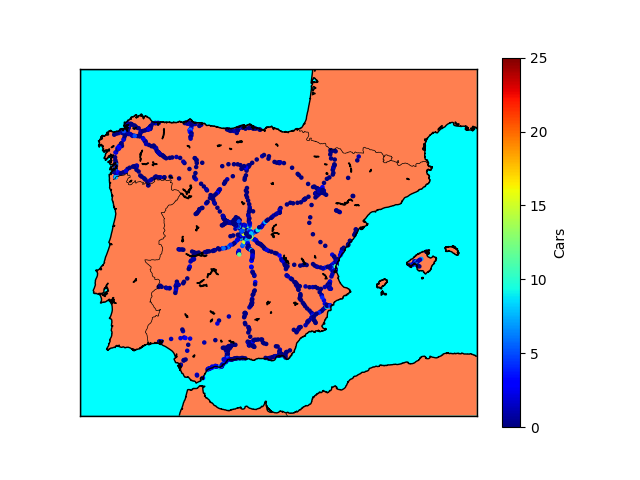

# CamiVista (CV)

|  |  |

CamiVista is an innovative open-source project that provides users with a comprehensive, real-time view of traffic conditions on Spanish highways. By scanning and analyzing data from highway cameras across the country, CamiVista offers accurate, up-to-date traffic mapping for optimized route planning and congestion reduction. Join us in enhancing travel experiences and promoting smarter transportation solutions.
